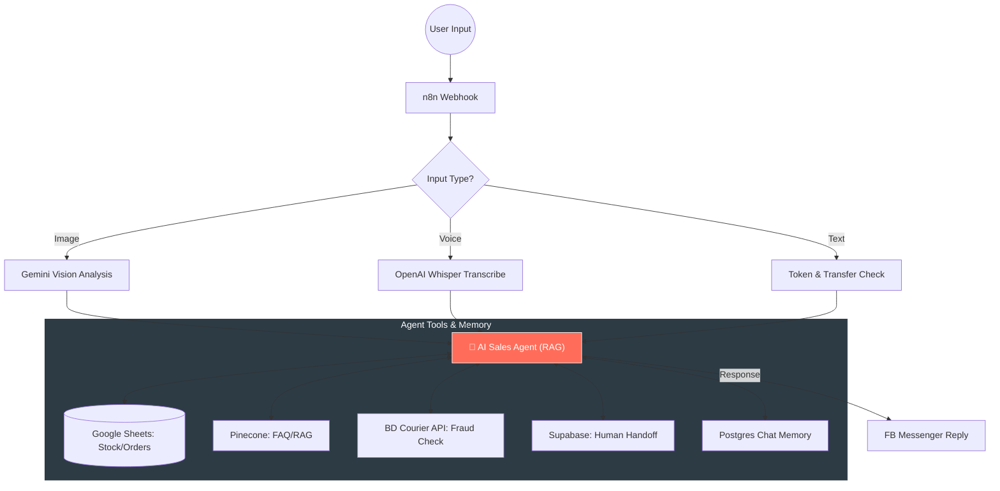

### 🤖 AI Sales Agent - Omni-Channel Automation


*An autonomous, multi-modal **AI Sales Agent** designed for Facebook Messenger. This agent handles the entire sales lifecycle—from product inquiries (text, voice, image) to inventory checking, fraud detection, and order placement—while maintaining a seamless human handoff protocol.*

---

## 🚀 Key Features

- **👁️ Multi-Modal Intelligence:** - Uses **Gemini Vision** to identify products directly from customer photos.
  - Uses **OpenAI Whisper** to transcribe and understand voice notes in real-time.
  
- **📦 Smart Inventory System:** - Real-time bi-directional sync with **Google Sheets**.
  - Checks stock before confirming orders and auto-updates inventory after sales.

- **🛡️ Fraud Detection:** - Integrated with **BD Courier API** to analyze customer phone numbers and delivery history (Success/Return ratio) before accepting COD orders.

- **🧠 RAG & Long-Term Memory:** - Uses **Pinecone Vector DB** for retrieving FAQs/Policies.
  - Maintains conversation context using **Postgres** memory.

- **🤝 Human Handoff Protocol:** - Intelligent intent detection triggers a seamless transfer to a human agent via **Supabase** when complex support is needed.

---

## 🛠️ System Architecture



---

## ⚙️ Setup & Installation

### 1. Prerequisites

* Self-hosted **n8n** instance (or Cloud version).
* **Supabase** project for backend logic.
* **Google Cloud Console** project with Sheets API enabled.
* **Pinecone** account for Vector Store.

### 2. Import Workflow

1. Download the `workflow.json` file from this repository.
2. Open your n8n dashboard.
3. Click **"Import from File"** and select the JSON file.

### 3. Environment Variables (Credentials)

You need to configure the following credentials in n8n:

| Service | Credential Name in n8n | Purpose |
| --- | --- | --- |
| **OpenAI** | `OpenAI Api` | For LLM logic & Whisper audio transcription. |
| **Google Gemini** | `Gemini API` | For analyzing product images. |
| **Facebook Graph** | `Facebook Graph API` | For sending/receiving Messenger chats. |
| **Google Sheets** | `Google Sheets OAuth2` | For database management. |
| **Pinecone** | `PineconeApi` | For Knowledge Base retrieval. |
| **BD Courier** | `BD Courier Auth` | For customer fraud check API. |
| **Postgres** | `Postgres DB` | For chat memory storage. |

---

## 📂 File Structure

```
├── workflow.json          # Main n8n workflow file (Cleaned)
├── README.md              # Documentation
└── assets/                # Diagram images

```

---

## 🤝 Contribution

Feel free to fork this repository and submit pull requests. For major changes, please open an issue first to discuss what you would like to change.

---

### 📬 Connect with Me

[](https://www.google.com/search?q=https://www.linkedin.com/in/uba-chan)
[](mailto:ubachan2025@gmail.com)


---
